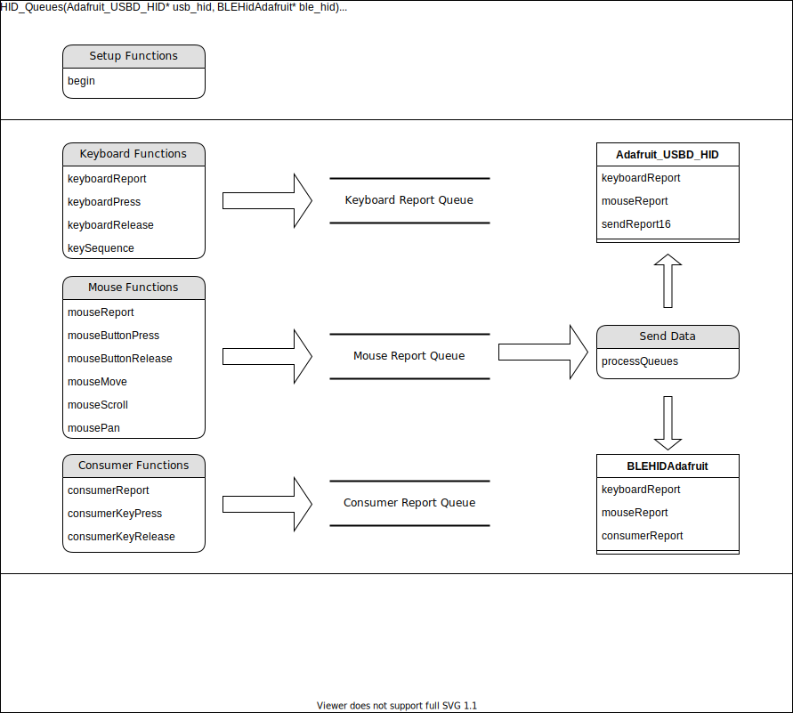

# BlueMicro_HID_Arduino_Library

[](https://github.com/jpconstantineau/BlueMicro_HID_Arduino_Library/tags)  [](https://github.com/jpconstantineau/BlueMicro_HID_Arduino_Library) [](https://github.com/jpconstantineau/BlueMicro_HID_Arduino_Library/issues)

[](https://github.com/jpconstantineau/BlueMicro_HID_Arduino_Library/actions/workflows/lint.yaml) [](https://github.com/jpconstantineau/BlueMicro_HID_Arduino_Library/actions/workflows/build-examples.yml)


A Universal Library for handling BLE and USB Human Interface Device (HID) with a computer.


# Dependencies

|Board Support Package Name| Libraries Needed | Notes |
|---|---|---|
| Adafruit nRF52 Boards | included in BSP | |
| Community nRF52 Add-On Boards | included in BSP | BSP Needs updating |
| Raspberry Pi RP2040 Boards | Adafruit TinyUSB Library | Library is separate download |
| Adafruit SAMD Boards | Adafruit TinyUSB Library | Library is separate download |

## Supported Processors

| Controller | Core                      | Flash     | RAM   | HID         |
| ---------  | ------------------------  | --------- | ----- | ----------- |
| nRF52832   | 1 ARM Cortex M4F @ 64Mhz  | 512Kb     | 128Kb | BLE         |
| nRF52840   | 1 ARM Cortex M4F @ 64Mhz  | 1MB       | 256Kb | USB & BLE   |
| SAMD21     | 1 ARM Cortex M0+ @ 48Mhz  | 256Kb     | 32KBb | USB         |
| SAMD51     | 1 ARM Cortex M4F @ 120Mhz | 512Kb     | 192Kb | USB         |
| RP2040     | 2 ARM Cortex M0+ @ 133Mhz | up to 2Mb | 264Kb | USB         |


## Requirements for Support by this library

- Arduino Board Support Package is available
- TinyUSB is used as the USB stack

Notes: 
- Board Support Packages (BSPs) based on the Arduino nRF52 stack do not use the same API for HID communications and do not use TinyUSB as the USB stack.  Seeeduino nRF52 and Arduino nRF52 BSPs are such examples.

- STM32duino does not use TinyUSB as the USB stack.

## Known Issues

See the [list of issues](https://github.com/jpconstantineau/BlueMicro_HID_Arduino_Library/issues) linked above.

# Examples

There are a number of examples you can use to start from.  The following examples are very similar but are tailored to specific hardware.

* `feather` - Simple test for barebones Feather boards
* `feather_neokey2` - Simple test for Feather boards with a NeoKey 2 Featherwing
* `itsybitsy` -  Simple test for ItsyBitsy boards
* `promicro` - Simple test for Boards with the form factor of a Pro Micro
* `qtpy` - Simple test for QT Py boards
* `rpipico` - Simple test for Raspberry Pi Pico

## Simple example

``` C++

#include <bluemicro_hid.h>

const int pin = 7; // UserSw
bool activeState = false;

void setup()
{


  bluemicro_hid.begin(); 
  
  // Set up button, pullup opposite to active state
  pinMode(pin, activeState ? INPUT_PULLDOWN : INPUT_PULLUP);

  Serial.begin(115200);
  Serial.println("BlueMicro_HID Composite example");
}

void loop()
{
  // poll gpio once each 10 ms
  delay(10);

  // Whether button is pressed
  bool btn_pressed = (digitalRead(pin) == activeState);

  /*------------- Mouse -------------*/
  if (btn_pressed )
  {
    int8_t const delta = 5;
    bluemicro_hid.mouseMove(delta, delta); // right + down
  }

  /*------------- Keyboard -------------*/
    // use to send key release report
    static bool has_key = false;

    if ( btn_pressed )
    {
      uint8_t keycode[6] = { 0 };
      keycode[0] = HID_KEY_A;

      bluemicro_hid.keyboardReport(0, keycode);

      has_key = true;
    }else
    {
      // send empty key report if previously has key pressed
      if (has_key) bluemicro_hid.keyboardRelease();
      has_key = false;
    }

    // Consumer Control is used to control Media playback, Volume, Brightness etc ...
    // Consumer report is 2-byte containing the control code of the key
    // For list of control check out https://github.com/hathach/tinyusb/blob/master/src/class/hid/hid.h

    // use to send consumer release report
    static bool has_consumer_key = false;

    if ( btn_pressed )
    {
      // send volume down (0x00EA)
      bluemicro_hid.consumerKeyPress(HID_USAGE_CONSUMER_VOLUME_DECREMENT);
      has_consumer_key = true;
    }else
    {
      // release the consume key by sending zero (0x0000)
      if (has_consumer_key) bluemicro_hid.consumerKeyRelease();
      has_consumer_key = false;
    }
    
  bluemicro_hid.processQueues(CONNECTION_MODE_AUTO);
}
```
# Overview of the Library





# BlueMicro_HID API

The following API is available if the BlueMicro_HID library in included in a sketch file.
## Optional Setting & Parameters to set before Begin
### bluemicro_hid.setBLEManufacturer("BLE_Manufacturer");
### bluemicro_hid.setBLEModel("BLE_Model");
### bluemicro_hid.setBLETxPower(4);
### bluemicro_hid.setHIDMessageDelay(10);
This function changes the internal delay that's used between HID messages when multiple messages are queued up and processed with a single `bluemicro_hid.processQueues` call.

Default value is `10` for 10 msec. 

### bluemicro_hid.setUSBPollInterval(2);
### bluemicro_hid.setUSBStringDescriptor("USB_Descriptor");
## bluemicro_hid.begin();

## Sending buffers
### bluemicro_hid.processQueues(CONNECTION_MODE_AUTO);

Available connection Modes:
``` c++
CONNECTION_MODE_AUTO
CONNECTION_MODE_USB_ONLY
CONNECTION_MODE_BLE_ONLY
```
